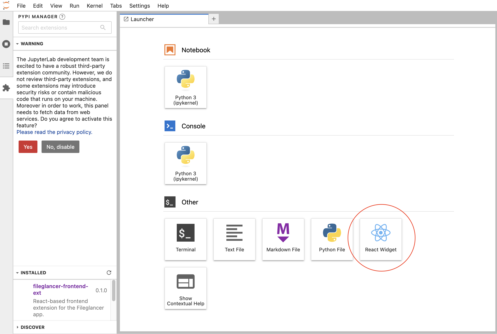

# Fileglancer frontend extension

[](https://github.com/JaneliaSciComp/fileglancer/actions/workflows/build.yml)
[](https://mybinder.org/v2/gh/JaneliaSciComp/fileglancer/main?urlpath=lab)

React-based frontend extension for the Fileglancer app.

## Development install

Clone the repo to your local environment and change directory to the new repo folder.

```bash
git clone git@github.com:JaneliaSciComp/fileglancer.git
cd fileglancer
```

If this is your first time installing the extension in dev mode, install package in development mode.

```bash
pixi run dev-install
```

If you've installed the extension in dev mode before, run the clean dev install command to clean up previous installation and remove the symlink to the old extension.

```bash
pixi run clean-dev-install
```

Build the extension for development

```bash
pixi run dev-build
```

In new terminal, run Jupyter Lab in autoreload mode:

```bash
pixi run dev-launch
```

Saved changes in your directory should now be automatically built locally and available in your running JupyterLab. Refresh JupyterLab to load the change in your browser (you may need to wait several seconds for the extension to be rebuilt).

If everything has worked so far, you should see the React Widget on the Launcher pane:



### Development uninstall

```bash
pixi run uninstall
```

In development mode, you will also need to remove the symlink created by `jupyter labextension develop`
command. To find its location, you can run `jupyter labextension list` to figure out where the `labextensions`
folder is located. Then you can remove the symlink named `fileglancer` within that folder.

### Testing the extension

#### Frontend tests

This extension is using [Jest](https://jestjs.io/) for JavaScript code testing.

To execute them, execute:

```sh
jlpm
jlpm test
```

#### Integration tests

This extension uses [Playwright](https://playwright.dev/docs/intro) for the integration tests (aka user level tests).
More precisely, the JupyterLab helper [Galata](https://github.com/jupyterlab/jupyterlab/tree/master/galata) is used to handle testing the extension in JupyterLab.

More information are provided within the [ui-tests](./ui-tests/README.md) README.

### Packaging the extension

See [RELEASE](RELEASE.md)
